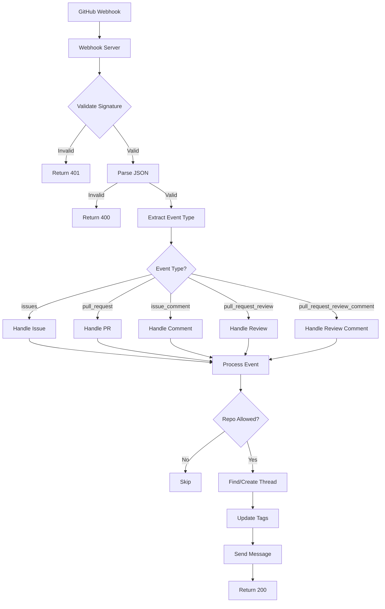
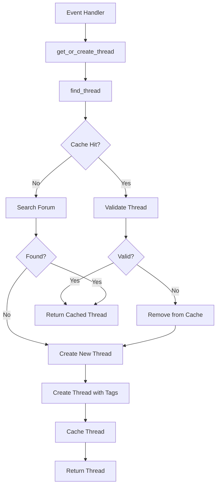
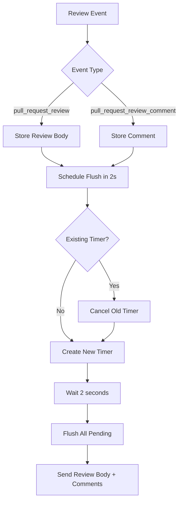
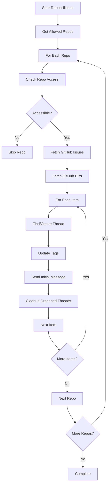

# GenHub Bot - Comprehensive Technical Documentation

## Table of Contents
1. [Overview](#overview)
2. [Architecture](#architecture)
3. [Core Components](#core-components)
4. [Data Flow](#data-flow)
5. [Event Processing Flow](#event-processing-flow)
6. [Thread Management System](#thread-management-system)
7. [Configuration System](#configuration-system)
8. [Review Batching System](#review-batching-system)
9. [Reconciliation System](#reconciliation-system)
10. [Alternative Architectures](#alternative-architectures)
11. [Potential Improvements](#potential-improvements)
12. [Use Cases](#use-cases)

## Overview

GenHub is a Discord bot cog for Redbot that bridges GitHub repository events to Discord forum channels. It receives webhook events from GitHub and creates/updates corresponding forum threads, enabling seamless integration between GitHub repositories and Discord communities.

### Key Features
- **Real-time GitHub Event Processing**: Handles issues, PRs, comments, and reviews
- **Forum Thread Management**: Automatic thread creation and updates
- **Tag Synchronization**: Maintains status tags (Open/Closed/Merged)
- **Review Batching**: Groups review comments to prevent spam
- **Reconciliation**: Syncs existing GitHub items with Discord threads
- **Multi-repository Support**: Handles multiple GitHub repositories
- **Role Mentioning**: Configurable contributor role notifications

## Architecture

### High-Level Architecture

```
┌─────────────────┐    ┌─────────────────┐    ┌─────────────────┐
│   GitHub Webhook │───▶│  Webhook Server │───▶│ Event Handlers  │
│     Events       │    │   (aiohttp)     │    │                 │
└─────────────────┘    └─────────────────┘    └─────────────────┘
                                                        │
                                                        ▼
┌─────────────────┐    ┌─────────────────┐    ┌─────────────────┐
│   Thread Cache   │◀──▶│ Thread Manager  │───▶│ Discord Forums  │
│                 │    │                 │    │                 │
└─────────────────┘    └─────────────────┘    └─────────────────┘
                                                        │
                                                        ▼
┌─────────────────┐    ┌─────────────────┐    ┌─────────────────┐
│ Configuration   │    │   Commands      │    │   Persistence   │
│   Manager       │    │   Interface     │    │   (Redbot)      │
└─────────────────┘    └─────────────────┘    └─────────────────┘
```

### Component Responsibilities

| Component | Responsibility |
|-----------|----------------|
| **GenHub Cog** | Main orchestrator, configuration management, lifecycle |
| **WebhookServer** | HTTP server for GitHub webhook reception, signature validation |
| **GitHubEventHandlers** | Event processing logic, business rules |
| **Thread Manager** | Forum thread creation, updates, caching |
| **Config Commands** | Text-based configuration interface |
| **Slash Commands** | GUI-based configuration interface |
| **Reconciliation** | Sync existing GitHub state with Discord |

## Core Components

### 1. GenHub Cog (`genhub.py`)

**Purpose**: Main Redbot cog that orchestrates all functionality.

**Key Methods**:
- `cog_load()`: Initializes webhook server, loads cache, registers commands
- `cog_unload()`: Gracefully shuts down services, saves cache

**Configuration Schema**:
```python
{
    "webhook_host": "0.0.0.0",           # HTTP server bind address
    "webhook_port": 8080,                 # HTTP server port
    "github_secret": "",                  # Webhook signature secret
    "allowed_repos": [],                  # List of owner/repo strings
    "log_channel_id": None,               # Error logging channel
    "issues_forum_id": None,              # Issues forum channel ID
    "prs_forum_id": None,                 # PRs forum channel ID
    "issues_feed_chat_id": None,          # Issues announcement channel
    "prs_feed_chat_id": None,             # PRs announcement channel
    "contributor_role_id": None,          # Role to mention in notifications
    "github_token": "",                   # GitHub API token
    "thread_cache": {}                    # Thread object cache
}
```

### 2. Webhook Server (`webhook.py`)

**Purpose**: Receives and validates GitHub webhook events.

**Security Features**:
- HMAC-SHA256 signature validation
- JSON payload verification
- Error logging and responses

**Flow**:
```
GitHub POST /github
    ↓
Validate Signature
    ↓
Parse JSON Payload
    ↓
Extract Event Type
    ↓
Pass to Event Handlers
    ↓
Return 200/400/401/500
```

### 3. Event Handlers (`handlers.py`)

**Purpose**: Processes different GitHub event types with business logic.

**Supported Events**:
- `issues`: opened, closed, reopened, assigned/unassigned
- `pull_request`: opened, closed, reopened, assigned/unassigned, merged
- `issue_comment`: created on issues
- `pull_request_review`: submitted reviews
- `pull_request_review_comment`: review comments

**Key Design Patterns**:
- **Event Dispatching**: Single entry point (`process_payload`) routes to specific handlers
- **Thread Management**: Centralized thread finding/creation logic
- **Review Batching**: Groups review comments to prevent notification spam

### 4. Thread Management (`utils.py`)

**Purpose**: Handles Discord forum thread lifecycle.

**Key Functions**:
- `find_thread()`: Locates existing threads by multiple patterns
- `get_or_create_thread()`: Creates threads with proper naming/tags
- `update_status_tag()`: Updates thread status tags
- `send_message()`: Splits long messages, handles mentions

**Thread Naming Convention**:
```
[GH] [#{number}] {title}
```

**Tag Management**:
- **Status Tags**: Open, Closed, Merged (mutually exclusive)
- **Repo Tags**: Repository name tags for multi-repo support
- **Activity Tags**: Active (for assigned items)

## Data Flow

### GitHub Event Processing Flow



### Thread Creation/Update Flow



## Event Processing Flow

### Issue/PR Event Processing

1. **Event Reception**: Webhook receives GitHub event
2. **Validation**: Check repository is in allowed list
3. **Forum Selection**: Choose issues or PRs forum based on event type
4. **Thread Lookup**: Search for existing thread by number
5. **Thread Creation**: Create if not found with proper naming/tags
6. **Message Formatting**: Format event-specific message
7. **Tag Updates**: Update status tags (Open/Closed/Merged)
8. **Message Sending**: Post formatted message to thread

### Review Processing (Special Case)

**Problem**: GitHub sends review body and comments as separate events, causing spam.

**Solution**: Review batching system with 2-second delay.



## Thread Management System

### Thread Naming Strategy

**Format**: `[GH] [#{number}] {title}`

**Benefits**:
- **Unique Identification**: Number-based lookup
- **Human Readable**: Title provides context
- **Namespace Isolation**: [GH] prefix prevents conflicts
- **Repository Context**: Number + title sufficient (repo tags handle multi-repo)

### Thread Caching Strategy

**Cache Keys**: Multiple formats for robustness
```python
keys_to_try = [
    (forum_id, repo_full_name, topic_number),
    (str(forum_id), repo_full_name, topic_number),
    f"{forum_id}:{repo_full_name}:{topic_number}",
]
```

**Cache Validation**:
- **Staleness Check**: Verify thread still exists
- **Permission Check**: Ensure bot can access thread
- **Automatic Cleanup**: Remove invalid entries

### Tag Management

**Status Tags** (Mutually Exclusive):
- `Open`: Issue/PR is open
- `Closed`: Issue/PR closed (not merged)
- `Merged`: PR was merged

**Repository Tags**:
- One tag per repository (e.g., "MyRepo")
- Enables filtering in large forums

**Activity Tags**:
- `Active`: Issue has assignees

## Configuration System

### Configuration Interfaces

**Text Commands** (`!genhub <command>`):
- `host <host>`: Set webhook host
- `port <port>`: Set webhook port
- `secret <secret>`: Set GitHub secret
- `token <token>`: Set GitHub token
- `addrepo <repo>`: Add allowed repository
- `removerepo <repo>`: Remove repository
- `issuesforum <id>`: Set issues forum
- `prsforum <id>`: Set PRs forum
- `issuesfeedchat <id>`: Set issues chat
- `prsfeedchat <id>`: Set PRs chat
- `contributorrole <id>`: Set contributor role
- `showconfig`: Display current config

**Slash Commands** (`/genhubconfig`):
- Single command with multiple optional parameters
- Discord UI autocomplete for channel/role selection

### Environment Variables

**Priority**: Environment > Config
- `GENHUB_GITHUB_TOKEN`: GitHub API token (recommended for security)

## Review Batching System

### Problem Statement
GitHub sends review events separately:
1. `pull_request_review` (review body)
2. `pull_request_review_comment` (each comment)

**Without Batching**: 50 comments = 50 Discord messages + 50 notifications

### Solution: Time-Based Batching

**Mechanism**:
1. Store review data in `pending_reviews` dict
2. Schedule flush task with 2-second delay
3. Cancel previous timer if new event arrives
4. Flush all accumulated data at once

**Data Structure**:
```python
pending_reviews = {
    (repo, pr_number, review_id): {
        "author": str,
        "url": str,
        "body": str,           # Review body
        "comments": list,      # [(body, url), ...]
        "task": asyncio.Task   # Flush timer
    }
}
```

**Benefits**:
- **Spam Prevention**: One notification per review
- **Logical Grouping**: All review content together
- **Performance**: Reduced API calls

## Reconciliation System

### Purpose
Sync existing GitHub repository state with Discord forum threads.

**Use Cases**:
- **Initial Setup**: Populate forum with existing issues/PRs
- **Recovery**: Restore threads after bot restart/crash
- **Cleanup**: Remove threads for deleted GitHub items

### Reconciliation Flow



### Orphaned Thread Cleanup

**Logic**:
1. Get all threads in forum
2. Extract issue/PR numbers from thread names
3. Check if corresponding GitHub item exists
4. Delete threads without GitHub counterparts

**Safety Measures**:
- Repository tag verification
- Permission checks before deletion
- Error handling for API failures

## Alternative Architectures

### 1. Database-Backed Thread Storage

**Current**: In-memory cache with Redbot config persistence
**Alternative**: PostgreSQL/SQLite with proper ORM

**Benefits**:
- **Scalability**: Handle thousands of threads
- **Reliability**: ACID transactions
- **Querying**: Complex thread lookups
- **Backup**: Proper database backups

**Trade-offs**:
- **Complexity**: Additional dependency
- **Performance**: Database round-trips
- **Maintenance**: Schema migrations

### 2. Message Queue Architecture

**Current**: Direct processing in webhook handler
**Alternative**: Webhook → Queue → Worker Pool

**Benefits**:
- **Reliability**: Survive restarts without losing events
- **Scalability**: Multiple workers for high load
- **Monitoring**: Queue depth metrics
- **Rate Limiting**: Built-in backpressure

**Implementation**:
```python
# Webhook handler
async def webhook_handler(self, request):
    # Validate and queue
    await queue.put(event_data)
    return web.Response(status=202)  # Accepted

# Worker
async def process_queue():
    while True:
        event = await queue.get()
        await self.handlers.process_payload(None, event)
```

### 3. Event-Driven Architecture with Plugins

**Current**: Monolithic event handlers
**Alternative**: Plugin system with event hooks

**Benefits**:
- **Extensibility**: Custom event handlers
- **Modularity**: Separate concerns
- **Testing**: Isolated component testing
- **Community**: Third-party plugins

**Architecture**:
```python
class EventPlugin(ABC):
    @abstractmethod
    async def can_handle(self, event_type: str) -> bool:
        pass
    
    @abstractmethod
    async def handle(self, event_data: dict) -> None:
        pass

# Plugin registry
plugins = [IssuePlugin(), PRPlugin(), ReviewPlugin()]
```

### 4. GraphQL API Integration

**Current**: REST API calls for reconciliation
**Alternative**: GitHub GraphQL API

**Benefits**:
- **Efficiency**: Single query for complex data
- **Flexibility**: Precise field selection
- **Rate Limits**: Fewer API calls
- **Real-time**: GraphQL subscriptions

## Potential Improvements

### 1. Performance Optimizations

**Thread Cache Improvements**:
- **LRU Cache**: Evict least recently used threads
- **Background Validation**: Async cache validation
- **Compression**: Compress cached thread data

**API Call Optimization**:
- **Batch Operations**: Bulk Discord API calls
- **Connection Pooling**: Reuse HTTP connections
- **Caching**: Cache GitHub API responses

### 2. Reliability Enhancements

**Error Handling**:
- **Circuit Breaker**: Fail gracefully on API outages
- **Retry Logic**: Exponential backoff for transient failures
- **Dead Letter Queue**: Store failed events for retry

**Monitoring**:
- **Metrics**: Event processing rates, error counts
- **Health Checks**: Webhook health endpoint
- **Logging**: Structured logging with correlation IDs

### 3. Feature Enhancements

**Advanced Filtering**:
- **Event Type Filtering**: Per-repository event preferences
- **User Filtering**: Ignore bot-generated events
- **Content Filtering**: Skip low-value updates

**Rich Embeds**:
- **GitHub Embeds**: Rich previews of issues/PRs
- **Diff Previews**: Show code changes in Discord
- **Author Avatars**: Display GitHub profile pictures

**Integration Features**:
- **GitHub Actions**: Trigger workflows from Discord
- **Discord Commands**: Create issues/PRs from Discord
- **Status Updates**: Show CI/CD status in threads

### 4. Security Improvements

**Webhook Security**:
- **IP Whitelisting**: Only accept GitHub IPs
- **Request Signing**: Additional signature validation
- **Rate Limiting**: Prevent abuse

**Permission System**:
- **Granular Permissions**: Per-channel, per-repository access
- **Audit Logging**: Track all configuration changes
- **Secret Rotation**: Automated webhook secret rotation

---

## Conclusion

GenHub represents a robust solution for bridging GitHub and Discord communities. Its modular architecture, comprehensive event handling, and thoughtful design decisions make it suitable for a wide range of use cases from small open source projects to large enterprise environments.

The codebase demonstrates good software engineering practices with proper separation of concerns, error handling, and extensibility considerations. The alternative architectures and improvement suggestions provide a roadmap for future enhancements while maintaining backward compatibility.

The review batching system and thread management optimizations show particular attention to user experience, preventing notification spam while ensuring comprehensive information delivery.
